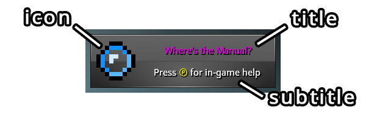

<p align="center">

</p>

# Notifications

This module provides an event-based system to show notifications, e.g., achievements or one-time help notes, in a common
notification area. Messages can be added and removed by sending events.

The system currently only reacts to events without keeping the state of notifications for a player!

## Usage

To show or hide notifications from other modules add a dependency in `module.txt`:
```json5
  { "id": "Notifications", "minVersion": "0.1.0-SNAPSHOT" }
```

The displayed message itself is defined by the `Notification` class. Each message has an `id` to be able to identify 
duplicate messages or remove a specific notification. The system ensures that there is at most one message of the same 
identifier displayed on screen.

A notification may contain an _icon_, displayed on the left. There is room for two brief lines of text, the `title` and
a `subtitle`. See the image below for a visual representation of a notification. As the size of the notification box is
fixed developers should pay attention that the text fits into the available space.



Showing and hiding notifications is controlled via events. 

- `AddNotificationEvent(notification)` - is send to a client entity (and entity with `ClientComponent`). The event may 
    be consumed to prevent the message from showing. If a notification with the same `id` is already shown this event is
    ignored.
- `RemoveNotificationEvent(id)` - removes a notification for the entity it is sent to if present. Otherwise, this event
    is ignored.


